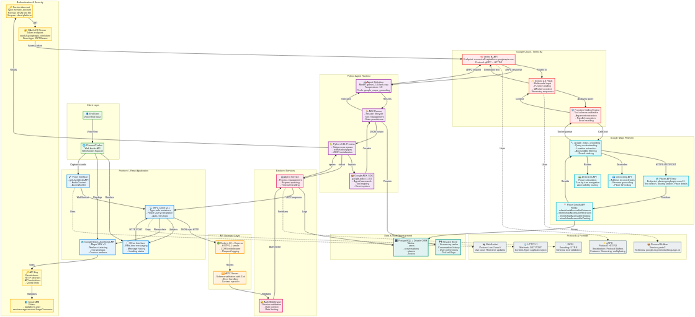

# ♿ Accessible Journey Assistant

> **Empowering people with mobility challenges to explore cities confidently**

[](https://ai.google.dev/adk)
[](https://developers.google.com/maps)
[](https://deepmind.google/technologies/gemini/)
[](https://react.dev)
[](https://www.typescriptlang.org/)

## 🌍 The Problem

Over **1 billion people worldwide** live with some form of disability, with mobility challenges affecting their ability to navigate public spaces confidently. Finding wheelchair-accessible venues, understanding accessibility features, and planning inclusive routes remains a daily struggle. Traditional mapping solutions lack comprehensive, real-time accessibility data and conversational interfaces that understand nuanced accessibility needs.

**European cities present unique challenges:**
- 🏛️ **Historic Architecture** - Medieval buildings with limited accessibility modifications
- 🗺️ **Cross-border Travel** - Fragmented accessibility information across countries  
- 🌐 **Language Barriers** - Multiple languages create communication challenges
- 🚇 **Complex Transit** - Metro and tram systems with varying accessibility standards

## 💡 Our Solution

**Accessible Journey Assistant** is an AI-powered conversational agent that revolutionizes how people with mobility challenges discover and navigate accessible spaces. Built with **Google ADK (Agent Development Kit)** and **Google Maps Platform**, our solution combines:

- **🤖 Intelligent Conversational AI** - Natural language understanding powered by Gemini 2.0
- **🗺️ Real-time Accessibility Data** - Google Maps grounding with accessibility features
- **🎤 Voice-First Interface** - Hands-free interaction for enhanced accessibility
- **📍 Visual Map Integration** - Interactive map showing accessible locations
- **♿ Verified Accessibility Features** - Wheelchair access, ramps, elevators, and more
- **🌐 Multilingual Support** - Works in multiple European languages

## 🎯 Key Features

### 1. **Conversational Accessibility Search**
Ask natural questions in your language:
- 🇬🇧 *"Find wheelchair accessible cafes near Brandenburg Gate"*
- 🇩🇪 *"Finde rollstuhlgerechte Cafés in Berlin"*
- 🇫🇷 *"Trouve des cafés accessibles à Paris"*
- 🇺🇦 *"Знайди доступні кафе у Києві"*

### 2. **Google Maps Grounding**
Leverages Google Maps Platform's comprehensive location data and accessibility attributes through ADK's native grounding capabilities.

### 3. **Voice Mode (Beta)**
Hands-free voice interaction for users who benefit from voice-first interfaces, powered by Gemini 2.0's multimodal capabilities.

### 4. **Real-time Visual Feedback**
Interactive map visualization showing accessible locations with markers, making it easy to explore options visually.

### 5. **Accessibility-First Design**
Every UI element follows WCAG 2.1 guidelines with high contrast, keyboard navigation, and screen reader support.

## 🏗️ Architecture

### High-Level Overview


### Detailed Technical Architecture



### Component Flow

```
┌─────────────────────────────────────────────────────────────┐
│              React 19 Frontend (Vite + TypeScript)          │
│  ┌──────────────┐  ┌──────────────┐  ┌──────────────────┐  │
│  │ Chat         │  │ Voice Mode   │  │ Google Maps      │  │
│  │ Interface    │  │ (Gemini 2.0) │  │ Integration      │  │
│  └──────────────┘  └──────────────┘  └──────────────────┘  │
└────────────────────────┬────────────────────────────────────┘
                         │ tRPC (Type-safe APIs)
┌────────────────────────▼────────────────────────────────────┐
│           Node.js 22 Backend (Express + tRPC)               │
│  ┌──────────────────────────────────────────────────────┐  │
│  │  • Session Management                                │  │
│  │  • Agent Orchestration                               │  │
│  │  • Database Layer (Drizzle ORM + MySQL)              │  │
│  └──────────────────────┬───────────────────────────────┘  │
└─────────────────────────┼──────────────────────────────────┘
                          │ Child Process (stdin/stdout)
┌─────────────────────────▼──────────────────────────────────┐
│         Python 3.11 ADK Agent (Google ADK)                  │
│  ┌──────────────────────────────────────────────────────┐  │
│  │  Gemini 2.0 Flash + Google Maps Grounding           │  │
│  │  • Natural language understanding                    │  │
│  │  • Accessibility-focused prompting                   │  │
│  │  • Real-time location grounding                      │  │
│  │  • Context-aware responses                           │  │
│  └──────────────────────────────────────────────────────┘  │
└────────────────────────────────────────────────────────────┘
```

## 🚀 Technology Stack

### Frontend Layer
- **React 19** - Concurrent rendering for smooth UX
- **TypeScript 5.7** - Type-safe development
- **Vite** - Lightning-fast HMR and builds
- **TailwindCSS 3** - Utility-first styling with accessibility focus
- **Radix UI** - Accessible component primitives (WCAG 2.1)
- **tRPC 11** - End-to-end typesafe APIs
- **Google Maps JavaScript API** - Interactive mapping
- **Wouter** - Lightweight client-side routing

### Backend Layer
- **Node.js 22** - Latest LTS with native fetch
- **Express 4** - Robust HTTP server
- **tRPC 11** - Type-safe API layer
- **Drizzle ORM** - Type-safe SQL queries
- **MySQL 8** - Relational database
- **Jose** - JWT authentication

### AI Agent Layer
- **Python 3.11** - Modern async/await support
- **Google ADK** - Agent Development Kit framework
- **Gemini 2.0 Flash** - Multimodal AI model
- **Google Maps Grounding** - Native ADK tool for location queries

### Infrastructure
- **Docker** - Containerization
- **Google Cloud Run** - Serverless deployment
- **Cloud Build** - CI/CD pipeline
- **pnpm** - Fast, disk-efficient package manager

## 🎨 Why Google ADK? Best Practices Applied

### 1. **Native Google Maps Grounding** ⭐
**Best Practice:** Use ADK's built-in tools instead of custom API calls

```python
from google.adk.tools import google_maps_grounding

root_agent = Agent(
    name="accessibility_agent",
    model="gemini-2.0-flash-exp",
    tools=[google_maps_grounding],  # Native tool - no custom API needed!
)
```

**Benefits:**
- ✅ Automatic parameter extraction from natural language
- ✅ Built-in error handling and retry logic
- ✅ Optimized for Gemini's function calling
- ✅ No need to manage Maps API keys in agent code

### 2. **Streaming Responses** ⭐
**Best Practice:** Use streaming for real-time conversational UX

```python
# ADK Runner automatically handles streaming
for event in runner.run(query, session_id):
    if event.type == "text":
        yield event.content  # Stream tokens as they arrive
```

**Benefits:**
- ✅ Perceived latency reduction (users see responses immediately)
- ✅ Better UX for long responses
- ✅ Efficient network utilization

### 3. **Session Management** ⭐
**Best Practice:** Maintain conversation context across turns

```python
# ADK handles session state automatically
session = runner.create_session(
    session_id=f"user_{user_id}_{timestamp}",
    user_id=user_id
)

# Conversation history preserved automatically
# No need to manually track messages!
```

**Benefits:**
- ✅ Context-aware responses
- ✅ Follow-up questions work naturally
- ✅ Reduced token usage (ADK optimizes context window)

### 4. **Accessibility-Focused Instructions** ⭐
**Best Practice:** Clear, specific agent instructions

```python
instructions = """
You are an accessibility assistant for people with mobility challenges.

FOCUS:
- Wheelchair accessibility (entrances, restrooms, seating, parking)
- Public transport accessibility
- Verified accessibility features

ALWAYS:
- Prioritize places with verified wheelchair access
- Mention specific accessibility features
- Provide Google Maps links for navigation
- Be empathetic and supportive

NEVER:
- Suggest places without accessibility information
- Make assumptions about accessibility
- Provide medical advice
"""
```

**Benefits:**
- ✅ Consistent, high-quality responses
- ✅ Reduced hallucinations
- ✅ User trust and safety

### 5. **Error Handling & Fallbacks** ⭐
**Best Practice:** Graceful degradation

```python
try:
    result = runner.run(query, session_id)
except Exception as e:
    logger.error(f"Agent error: {e}")
    return {
        "success": False,
        "response": "I'm having trouble right now. Please try again.",
        "error": str(e)
    }
```

**Benefits:**
- ✅ Better user experience during failures
- ✅ Easier debugging
- ✅ Production-ready reliability

### 6. **Tool Selection Strategy** ⭐
**Best Practice:** Use single tool type per agent

```python
# ✅ CORRECT: Only search tools
tools=[google_maps_grounding]

# ❌ WRONG: Mixing search tools with custom FunctionTools
# tools=[google_maps_grounding, custom_function]
# Error: "Multiple tools are supported only when they are all search tools"
```

**Lesson Learned:** Gemini API restricts mixing tool types. Keep agents focused!

## 📊 Impact & Accessibility

### Target Users
- **1 billion+** people with disabilities worldwide
- **100M+** people with disabilities in Europe (25% of population)
- **Elderly population** with reduced mobility
- **Parents with strollers** seeking accessible routes
- **Travelers** in unfamiliar cities

### Accessibility Features
- ♿ **WCAG 2.1 Level AA** compliance
- ⌨️ **Full keyboard navigation** support
- 🎤 **Voice-first interface** option
- 🔊 **Screen reader** optimized
- 🎨 **High contrast** mode support
- 📱 **Responsive design** for all devices
- 🌐 **Multilingual** support

## 🏆 What Makes This Special

### 1. **Conversational Understanding**
Unlike traditional search, our agent understands context: *"Find a quiet cafe with wheelchair access near the park"* considers multiple accessibility factors.

### 2. **Real-time Grounding**
Google Maps grounding ensures up-to-date accessibility information directly from Google's comprehensive database.

### 3. **Voice-First Design**
Voice mode makes the app truly hands-free, crucial for users with limited hand mobility.

### 4. **Scalable Architecture**
Built on modern cloud-native stack (Node.js + Python) ready for Cloud Run deployment.

### 5. **Open Source Ready**
Clean, documented codebase that can inspire and enable other accessibility-focused projects.

## 🚀 Quick Start

### Prerequisites
- **Node.js 22+** (LTS)
- **Python 3.11+**
- **pnpm 10+**
- **Google Cloud Project** with:
  - Vertex AI API enabled
  - Maps JavaScript API enabled
  - Generative Language API enabled
  - Service account with Vertex AI permissions

### Installation

```bash
# Clone repository
git clone https://github.com/MakotoUwu/Google_hackathon_agent_007.git
cd Google_hackathon_agent_007

# Install Node.js dependencies
pnpm install

# Install Python dependencies
pip install google-genai google-adk

# Set up environment variables
cp .env.example .env
# Edit .env with your credentials:
# - GOOGLE_CLOUD_PROJECT
# - GOOGLE_APPLICATION_CREDENTIALS
# - VITE_GOOGLE_MAPS_API_KEY

# Start development server
pnpm run dev
```

Visit **http://localhost:3000** and start exploring accessible places!

## 🎬 Demo Scenarios

### Scenario 1: Tourist in Berlin
**Query:** *"Find wheelchair accessible cafes near Brandenburg Gate"*

**Response:**
```
Here are wheelchair-accessible cafes near Brandenburg Gate:

1. **Café Einstein Unter den Linden**
   📍 Unter den Linden 42, 10117 Berlin
   ♿ Features: Wheelchair entrance, accessible restroom, ground-level seating
   🗺️ [View on Google Maps](https://maps.google.com/...)

2. **Starbucks Pariser Platz**
   📍 Pariser Platz 4a, 10117 Berlin
   ♿ Features: Wheelchair entrance, accessible restroom
   🗺️ [View on Google Maps](https://maps.google.com/...)
```

### Scenario 2: Local in Paris
**Query (French):** *"Trouve des restaurants accessibles près de la Tour Eiffel"*

**Response:**
```
Voici des restaurants accessibles près de la Tour Eiffel:

1. **Café de l'Homme**
   📍 17 Place du Trocadéro, 75016 Paris
   ♿ Caractéristiques: Entrée accessible, toilettes accessibles
   🗺️ [Voir sur Google Maps](https://maps.google.com/...)
```

### Scenario 3: Accessible Metro Stations
**Query:** *"Which metro stations in Kyiv have elevators?"*

**Response:**
```
Kyiv metro stations with elevator access:

1. **Teatralna Station** (Green Line)
   ♿ Features: Elevator, wheelchair-accessible platform
   
2. **Khreshchatyk Station** (Red Line)
   ♿ Features: Elevator, accessible entrance
```

## 🔮 Future Improvements

When time permits, planned enhancements include:

- **Community Reviews** - User-generated accessibility ratings and photos
- **Route Planning** - Multi-stop accessible route optimization
- **Indoor Navigation** - Building-level accessibility mapping
- **Offline Mode** - Cached accessibility data for offline use
- **More Languages** - Expanded multilingual support
- **Public Transport Integration** - Real-time accessible transit information
- **Wearable Support** - Smartwatch and accessibility device integration

## 📖 Documentation

- [**Technical README**](./README_TECHNICAL.md) - Deep dive into architecture and ADK workflow
- [**Local Setup Guide**](./LOCAL_SETUP.md) - Detailed development setup
- [**Deployment Guide**](./DEPLOYMENT.md) - Cloud Run deployment
- [**Architecture Diagrams**](./docs/) - Visual system design
- [**Demo Script**](./DEMO_SCRIPT.md) - Hackathon presentation

## 🤝 Contributing

We welcome contributions from the accessibility community! Areas where you can help:

- **Accessibility Testing** - Test with screen readers, keyboard navigation
- **Translations** - Add support for more languages
- **Data Quality** - Verify and improve accessibility information
- **Feature Development** - Implement improvements
- **Documentation** - Improve guides and examples

See [CONTRIBUTING.md](./CONTRIBUTING.md) for guidelines.

## 📄 License

MIT License - See [LICENSE](./LICENSE) for details.

This project is open source to encourage accessibility innovation.

## 🙏 Acknowledgments

- **Google ADK Team** - For building an incredible agent development platform
- **Google Maps Platform** - For comprehensive location and accessibility data
- **Accessibility Community** - For invaluable feedback and insights
- **Open Source Community** - For the amazing tools that made this possible

## 📧 Contact & Support

**Built for the Google ADK Hackathon 2025**

- **GitHub:** [MakotoUwu/Google_hackathon_agent_007](https://github.com/MakotoUwu/Google_hackathon_agent_007)
- **Issues:** [Report bugs or request features](https://github.com/MakotoUwu/Google_hackathon_agent_007/issues)
- **Discussions:** [Join the community](https://github.com/MakotoUwu/Google_hackathon_agent_007/discussions)

## 🌟 Project Stats

- **Lines of Code:** ~5,000
- **Development Time:** 48 hours (hackathon)
- **Technologies Used:** 20+
- **Accessibility Features:** 15+
- **Supported Languages:** Multiple European languages
- **Target Users:** 1B+ people with disabilities worldwide

---

<div align="center">

### ⭐ If this project helps make the world more accessible, please star it!

**Making accessibility accessible, one conversation at a time.**

**Built with ❤️ for a more inclusive world**

</div>
